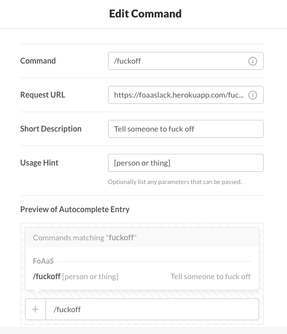

# FoAaS
Fuck Off As A Service - Slack outgoing webhook interface to FOaaS (http://www.foaas.com/)

# Set Up:
FoAaS can be used as an outgoing webhook or a slash command.

## Slash command:
* Create a Slash Command with the URL `https://foaaslack.herokuapp.com/fuckoff_slashcommand`

## Outgoing Webhook
* Create an Outgoing Webhook integration with the URL `https://foaaslack.herokuapp.com/fuckoff`

# Usage:

